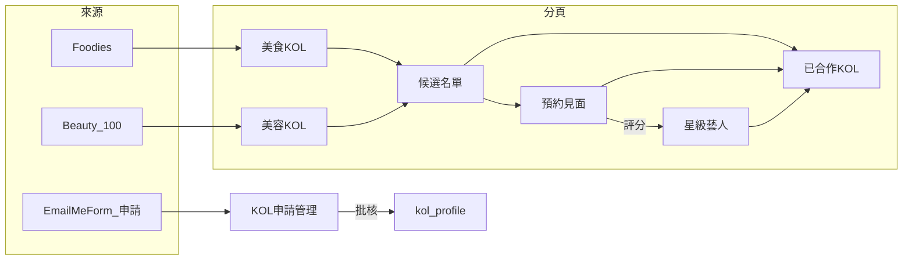

# KOL 模組需求整理

> 依據錄音內容、指定分頁結構，以及現有 MPS 程式／資料庫現況整理（截至 2026-07）  
> 模組路徑：`src/components/talent/` · 導航：`#talent/<subModule>` · 資料表：`kol_profile`、`kol_apply`

---

## 0. 現況摘要（開發前對照）

| 項目 | 現況 |
|------|------|
| 導航（KOL 分組） | `KOL列表`、`KOL申請管理`、`KOL活動` |
| 美食／美容分頁 | ❌ 未建 |
| 候選／約見／已合作／星級 | ❌ 未建 |
| 資料表 `kol_profile` | ✅ 約 1620 筆（Food Blogger Excel 匯入） |
| 資料表 `kol_apply` | ✅ 已建表，目前 0 筆 |
| 來源區分 Beauty 100 / Foodies | ❌ 無專用 `source` 枚舉；僅 `kol_apply.source` 文字欄 |
| 美食／美容標籤 | ⚠️ 僅 `blog_themes[]`（表單「Blog 的主題」），**無**獨立 `kol_category` |
| 生命週期狀態 | ❌ 無「候選／約見／已合作／星級」欄位 |
| 評分／認可／收費 | ❌ KOL 表無；藝人 `confirmed_artist` 有面試評分，但不共用 |
| 多維自定義標籤 | ⚠️ `blog_themes`、`specialty`；無通用 tag 表 |

### 0.1 現有 `blog_themes` 與美食／美容區分

表單「Blog 的主題」對應 `kol_profile.blog_themes`（可多選）。目前分布（`kol_profile`）：

| 主題 | 筆數 |
|------|------|
| 美食 Food | 1611 |
| 美麗事件 Beauty | 359 |
| 兩者皆有 | 358 |
| 僅美食 | 1253 |
| 僅美容／美麗 | 1 |
| 兩者皆無 | 8 |

**結論（已定案）：**

- **美食 KOL**：`blog_themes` 含「美食／Food」→ `primary_category = food`（可含 `both`）。
- **美容 KOL**：**等同「美麗事件 Beauty」** → `primary_category = beauty`（可含 `both`）。
- 匯入／回填時依 `blog_themes` 寫入 `primary_category`，分頁查詢以該欄為準，不再長期依賴字串即時匹配。

### 0.2 建議目標分頁（導航）

```
藝人管理
└── KOL（分組）
    ├── 美食 KOL          ← 新建
    ├── 美容 KOL          ← 新建
    ├── 候選名單          ← 新建
    ├── 預約見面          ← 新建
    ├── 已合作 KOL        ← 新建
    ├── 星級藝人          ← 新建
    ├── KOL列表           ← 保留（全量庫入口；6 頁為工作流視圖）
    ├── KOL申請管理       ← 既有（kol_apply）
    └── KOL活動           ← 既有（volunteer_*）
```

---

## 1. 分頁結構與各自核心功能

| 分頁 | 主要用途 | 核心功能需求 | 錄音對應重點 |
|------|----------|--------------|--------------|
| **美食 KOL** | 管理來自 Foodies 的美食類 KOL | - 從 Foodies 來源匯入／同步資料<br>- 列表展示（基本資料、近期內容、合作狀態）<br>- 支援篩選、搜尋、標籤過濾<br>- 可直接加入「候選名單」或標記為「已合作」 | 美食 KOL 會從 Foodies 取回 |
| **美容 KOL** | 管理來自 Beauty 100 的美容類 KOL | - 從 Beauty 100 來源匯入／同步資料<br>- 功能與「美食 KOL」對稱（列表、篩選、標籤） | 美容 KOL 從 Beauty 100 取回 |
| **候選名單** | 待篩選的潛在合作對象 | - 從美食／美容分頁批量或單筆加入<br>- 支援持續篩選（一邊看一邊 screen）<br>- 可快速操作：移至「預約見面」、加入標籤、直接評分<br>- 顯示來源、初步評分、加入時間 | 「keep 住有啲候選名單，一路 screen 嘅時間一路睇」 |
| **預約見面** | 正在安排或已安排見面的 KOL | - 從候選名單「kick 返去」進入此狀態<br>- 記錄約見時間、地點、負責人、備註<br>- 約見完成後可觸發「做翻啲評分」流程<br>- 支援狀態：待約、已約、已完成、取消 | 「方便咁再可以 kick 返去正在約見，跟住再做翻啲評分」 |
| **已合作 KOL** | 曾經或正在合作的 KOL 記錄 | - 記錄合作歷史、收費、項目類型、評價<br>- 可從任何分頁標記為「已合作」<br>- 支援回顧過去合作表現，方便再次使用 | 錄音提到「方便其他同事喺其他團隊都可以用得到佢」 |
| **星級藝人** | 經評分認可後的升級對象（收費、跨團隊可用） | - 只有評分達標後才能升級進入<br>- 顯示收費標準、認可時間、認可人<br>- 支援豐富標籤（內容創作者、MC、Model 等）<br>- 其他團隊可搜尋並申請使用 | 「如果同事嘅評分相對嚟講係 OK 嘅話，就會叫佢做可能一啲升級嘅藝人…有埋佢收費…一啲叫認可咗啦」 |

---

## 2. 跨分頁核心業務流程（錄音重點還原）

### 2.1 來源匯入

- 美食 KOL 從 **Foodies**、美容 KOL 從 **Beauty 100** 定期或手動同步。
- 匯入後預設進入對應分頁，狀態為「**未處理**」。

### 2.2 候選篩選

- 同事可將感興趣的 KOL 加入「**候選名單**」。
- 系統需支援大量數據（錄音提到可能有幾千個），因此必須有高效的篩選、分頁、標籤過濾與快速操作按鈕，避免「分唔到嘅時間」。

### 2.3 預約見面

- 從候選名單一鍵移至「**預約見面**」。
- 約見完成後，系統提示進行評分。

### 2.4 評分與認可

- 評分由同事填寫（可設計多維度：專業度、配合度、內容質量、粉絲互動等）。
- 若評分達標（「相對嚟講係 OK」），可升級為「**星級藝人**」。
- 升級時需設定**收費標準**，並標記為「**認可咗**」，方便其他團隊搜尋使用。

### 2.5 標籤系統（重要）

- 每個 KOL 可添加多個標籤，例如：內容創作者、MC、Model、以及自定義標籤。
- 標籤需在所有分頁通用，方便跨類型搜尋（錄音特別強調「加返啲唔同 tag」）。

### 2.6 已合作記錄

- 合作完成後可標記為「已合作」，並保留歷史評分與收費資訊，方便後續複用。



---

## 3. 功能細節與設計建議

### 3.1 資料欄位建議（共通）

| 類別 | 欄位 |
|------|------|
| 基本 | 姓名／藝名、平台帳號、粉絲數、來源（Beauty 100 / Foodies / 手動 / 表單）、聯絡方式 |
| 狀態 | 候選、約見中、已合作、星級藝人（建議 `lifecycle_status` 或獨立狀態表） |
| 評分 | 多位同事可評、平均分、最近評分時間 |
| 標籤 | 多選＋自定義（建議 `kol_tags text[]` 或 tag 關聯表） |
| 收費 | 僅星級藝人可見／可編輯 |
| 歷史 | 合作記錄、約見記錄、評分歷史 |

### 3.2 與現有表對照（建議擴充）

**`kol_profile`（KOL 主檔，已有）**

- 已有：身份、平台、試食、相片、`blog_themes`、`applied_at` 類來源欄等。
- 建議新增：
  - `primary_category` — `food` \| `beauty` \| `both` \| `other`
  - `source_system` — `foodies` \| `Beauty100` \| `emailmeform` \| `manual`
  - `lifecycle_status` — `unprocessed` \| `shortlist` \| `meeting` \| `cooperated` \| `star`
  - `tags text[]` — MC、Model、內容創作者等（與 `blog_themes` 分離）
  - `fee_standard` — 星級藝人收費
  - `recognized_at` / `recognized_by` — 認可時間／人

**`kol_apply`（申請佇列，已有）**

- 已有：`applied_at`、`audit_status`、表單欄位鏡像。
- 批核後寫入 `kol_profile`，並可帶 `source_system = emailmeform`。

**建議新表（後續）**

| 表名 | 用途 |
|------|------|
| `kol_meeting` | 預約見面：時間、地點、負責人、狀態、備註 |
| `kol_rating` | 多同事、多維度評分歷史 |
| `kol_cooperation` | 已合作：項目、收費、評價、日期 |
| `kol_tag`（可選） | 標籤字典 + 多對多關聯 |

### 3.3 權限與協作

| 角色 | 能力 |
|------|------|
| 一般同事 | 查看、加入候選、評分、約見 |
| 管理員／特定角色 | 認可升級、設定收費、批量操作 |
| 其他團隊 | 搜尋「星級藝人」並申請使用（跨團隊共用） |

### 3.4 大量數據處理

- 候選名單需支援「一邊 screen 一邊操作」的流暢體驗（快速標記、快速移轉狀態）。
- 建議加入「**我的候選**」或「**最近瀏覽**」快速入口，避免在幾千筆資料中迷失。
- 列表沿用現有 KOL 列表模式：每頁 100 條、進階篩選、卡片／表格切換。

### 3.5 邊界與例外情況

| 情況 | 處理 |
|------|------|
| 同一人同時屬美食與美容 | 可在兩邊分頁出現，但**共用同一** `kol_profile`、評分與標籤 |
| 約見取消 | 可退回候選名單 |
| 評分未達標 | 可繼續留在候選或已合作，**不強制**升級星級 |
| 來源資料更新 | 需衝突處理（例如聯絡方式變更）；預設跳過不覆蓋或記錄 diff |

---

## 4. 建議優先開發順序

| 階段 | 內容 |
|------|------|
| **P1** | 美食 KOL + 美容 KOL 分頁與來源匯入；`primary_category` / `source_system` 欄位 |
| **P2** | 候選名單 + 狀態移轉（加入候選、移至約見） |
| **P3** | 評分功能 + 星級藝人升級流程（含收費、認可） |
| **P4** | 標籤系統與跨分頁搜尋 |
| **P5** | 預約見面詳細記錄（`kol_meeting`）與已合作歷史（`kol_cooperation`） |

---

## 5. 附錄：EmailMeForm 與現有欄位

表單：[KOL 加入成為美食博客 Food Blogger](https://www.emailmeform.com/builder/form/X8YL5Nf9VPffJO8jz)

- 絕大部分欄位已映射至 `kol_profile` / `kol_apply`。
- 「Blog 的主題」→ `blog_themes`（含美食 Food、美麗事件 Beauty 等）。
- 已補獨立欄：`video_blog_promo`、`facebook_live_interest`。
- **尚無**：生命週期狀態、星級收費、通用 skill tags（MC/Model 等）。

---

## 6. 產品決策

### 已定案（2026-07-30）

| # | 議題 | 決定 |
|---|------|------|
| 1 | **KOL列表** 是否保留 | ✅ **保留** — 作為全量庫；6 個新分頁為工作流視圖（同一 `kol_profile`，不同篩選） |
| 2 | **美容** 分類定義 | ✅ **等同「美麗事件 Beauty」** — 回填規則：`blog_themes` 含 Beauty → `primary_category = beauty`（與 Food 並存則 `both`） |

### 待確認

1. **星級藝人** 與 **藝人列表**（`confirmed_artist`）是否合併、還是 KOL 專用升級軌道？
2. Foodies / Beauty 100 匯入為 **API 同步** 還是延續 **Excel／表單** 批次？

---

*文件版本：2026-07-30 · 維護：藝人管理 / KOL 模組*
